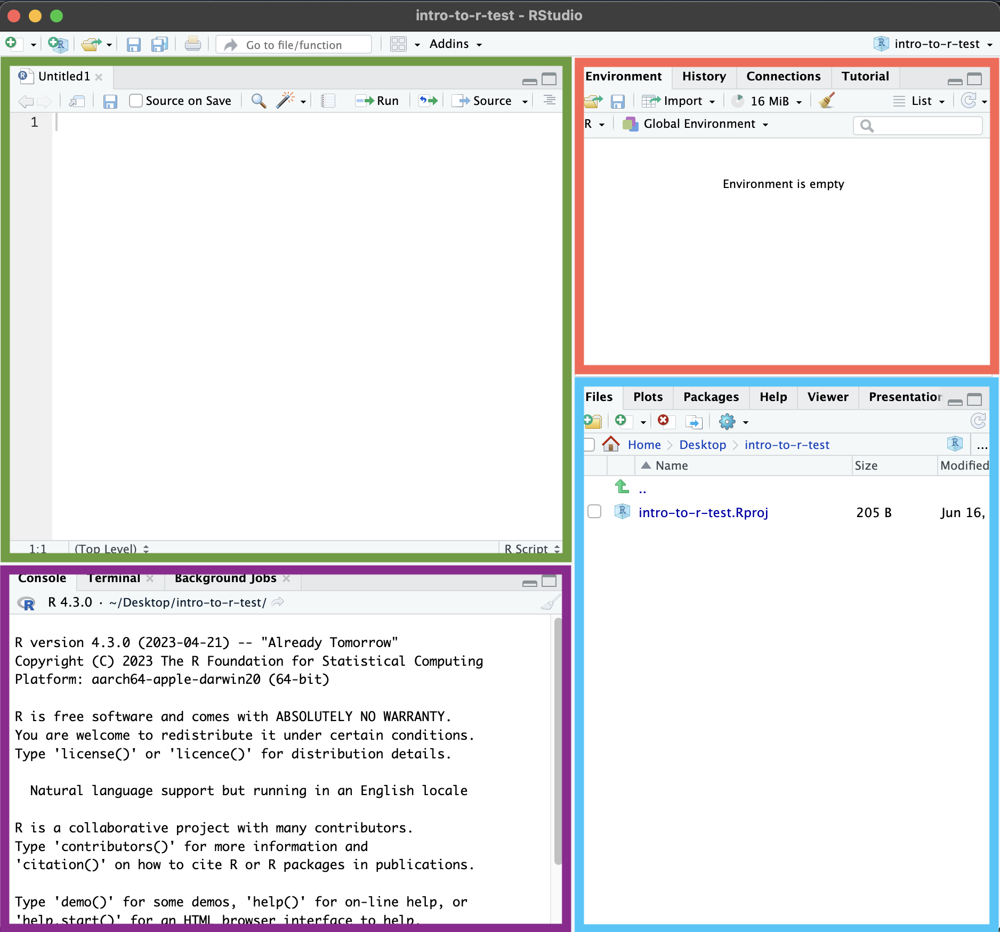

The Basics of R and RStudio
===================================

## Learning Objectives
> *  Create an R project.
> *  Describe the purpose of RStudio’s script, console, environment, and file/plot/help windows.
> *  Assign names to objects in R with <- and =.
> * Solve mathematical operations in R.
> * Organize files and directories for a set of analyses as an R Project.
* * *

# Introducing R and RStudio
R and RStudio are distinct programs and need separate downloads and installations. 

R is:
- An open-source programming language under GPL
- Aimed as a statistics and data analysis environment
- Adapted to build websites, run simulations, and more
- Good general language as is both object-orientated and functional language

R is the underlying statistical computing environment, but using R alone is not as intuitive 

RStudio is:
- An graphical Integrated Development Environment (IDE) makes using R much easier and more interactive
- Makes developing code in R easier

# Installation
 You need to install R before you install RStudio. Please choose the operating system (OS) that you use from the key information tab. 


# Open up a new Project
- Under the File menu, click on New project, choose New directory, then Empty project
- Enter a name for this new folder, and choose a convenient location for it. This will be your working directory for the rest of the day (e.g., ~/data-carpentry)
- Confirm that the folder named in the Create project as a sub-directory of the box is where you want the working directory created. Use the Browse button to navigate folders if changes are needed.
- Click on “Create project”
- Under the Files tab on the right of the screen, click on New Folder and create a folder named data within your newly created working directory. (e.g., ~/data-carpentry/data)
- Create a new R script (`File > New File > R script`) and save it in your working directory (e.g. data-carpentry-script.R)s
- We can open it by clicking the New File button or using the `Ctrl-Shift-N` keyboard shortcut (`Cmd-Shift-N`) on Mac

# Layout of RStudio and Interacting with R

Parts of the RStudio 


-  Folder setup, Plots, Packages, Help, and more <b> Blue </b>
    - Let's save the Rscript we have been writing into. Please select `File --> Save` and enter in a suitable name for your Rscript. 
    - You should see this is now available in the folder.
    - We will explore the other tabs in this corner in the next sections.  

- Interpreter/Console is where R is actually running <b> Dark purple </b>
    - Work in here interactively. 
    - Let's first try and run our first line of code into our console. I will explain more about this in a bit.
```
    "Hello"
```
    - Type commands directly into the console, but they will be forgotten when you close the session.

- Text editor  <b> Green </b>
    - Where we write code we want to keep and potentially reuse later
    - Creates a plain text file that stores the code we’ve written
    - Let's write the same line of code as before in the text editor.
```
    "Hello"
```
    - You can copy-paste into the R console, but the Rstudio script editor allows you to ‘send’ the current line or the currently selected text to the R console using the `Ctrl-Enter` shortcut.
    - Better to enter the commands in the script editor, and save the script. This way, you have a complete record of what you did, you can easily show others how you did it and you can do it again later on if needed. 
    - `>` indicates that R is ready to accept commands.
    - Let's write the code that creates an error:
```
    "Hello
```
    - `+` indicates that R is waiting for you to finish entering a command. This is usually due to not writing the pair of brackets or quotations.

- Environment, History, Git, and more  <b> Orange </b>
    - You can even use R like a sophisticated calculator. Run the commands below.
```  
    3 + 5
    12/3
```
    - But if you want to be able to access a value later, we need to assign <i> values </i> to <i>objects </i>. 
    - You can either assign a value using `<-` or `=`. 
    - However, it is good practce to use `<-` for assignments and `=` for values of arguements in a function. 
```
    name <- "Hello"
    name = "Hello"
```

    - You should now be able to see the name in the environment tab. Does it tell you anything about 

> Hint - A comment is a line of code with `#` at the beginning. This signifies to the R interpreter to not use this line as code but in fact information about the code. 
```
    #Assign 9 to a 
    a <- 9
    #Assign 2 to b
    b <- 2
```


<b> Exercise </b>
- How much are a and b added together?
- Change the value of a to 10
- Assign the value of a and b together to a new variable, c.


****
Material adapted from (https://datacarpentry.org/R-genomics/01-intro-to-R.html) and (https://datacarpentry.org/semester-biology/materials/r-intro/)

