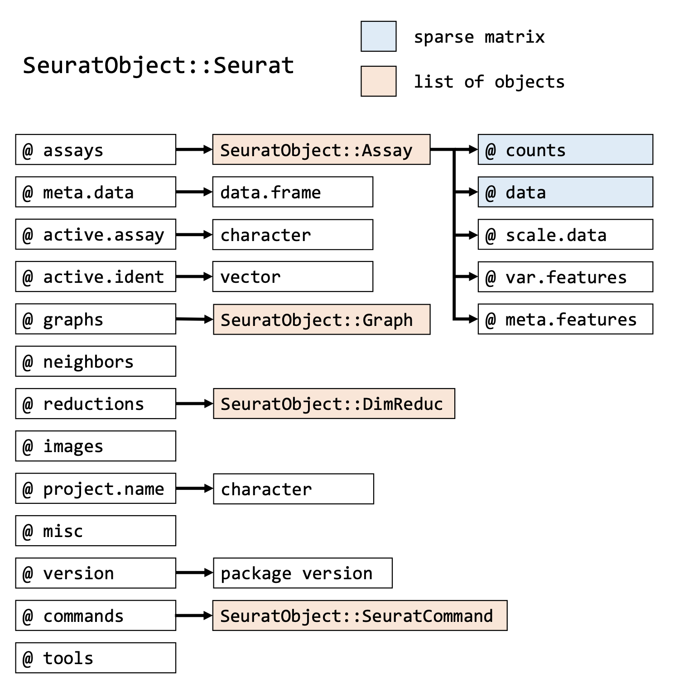

> ## Learning Objectives
>
> -   Describe what variables, vectors, and matrices are and how they can be manipulated in R.
> -   Use the built-in RStudio help interface to search for more information on R functions.
> -   Describe what a function is in R.
> -   Inspect the content of vectors in R and describe their content with class and str.
> -   Learn what errors and warnings are and how to approach them

# Recap Variables

A variable is a name that has a value associated with it

```         
# Assigns a value to a variable
genome_size_mb <- 35

# Assigns a value to a variable and prints it out on the console
(genome_size_mb <- 35)

# Prints out the value of a variable on the console
genome_size_mb
```

> Hint: tab key autocompletes.
> `Type geno and then tab`.
> Let the computer do repetitious work.
> It’s easier and with fewer mistakes.
> Hint: A history of the commands you’ve run under `History` in case you forgot to write something down

# Functions

A function is a "canned script" that automates the processing of input and returns a value.

We will be using <i>in-built</i> functions in this session meaning that you don't need to run `library("package name")` to get them to work <b>(these in-built functions are known as "base R")</b>.
Other functions need to be first loaded (more on this later) before they can be <i>executed</i>.
For instance with `sqrt`: the input (the argument) must be a number, and the return value (in fact, the output) is the square root of that number.
Executing a function or running it is called <i>calling</i> the function.

```         
sqrt(49)
```

A function call is composed of two parts.
- Name of the function
- Arguments that the function requires to return and output.

For instance as above: `sqrt()` is the name of the function, and `49` is the argument.

We can also pass variables as the argument.

```         
genome_length_mb <- 4.61
sqrt(genome_length_mb)
```

Functions can take multiple arguments.
For instance, let's round genome_length_mb to one decimal place.
Typing `round()` shows there are two arguments (pops up a yellow box).

If you know the function, but don't know how to use it, we can use the `help` command too.

```         
help(round)
```

> Hint: Other helpful commands to explain the function are `?` before the function e.g. `?round` and `args(round)`

However, if you are not sure what function is appropriate, you can search all the help pages by running the `help.search` function.
Of course you can also search using Google/an LLM but remember to specify that you are using R ("eg how to round a number to one decimal place in R")

```         
help.search("rounding of numbers")
```

For the round function, there are two arguments: 1) the number to be rounded and 2) the number of digits

```         
round(genome_length_mb, 1)
```

Functions return values, so as with other values and expressions, if we don’t save the output of a function, then there is no way to access it later.
Check the current value using the `print` command.

```         
print(genome_length_mb)
```

To save the output of a function, we assign it to a variable.

```         
genome_length_mb_rounded <- round(genome_length_mb, 1)
```

> ## Exercise
>
> -   Now that R has genome_length_mb in memory, we can do arithmetic with it.
> -   For instance, we may want to convert this to the weight of the genome in picograms (for some reason).
>
> <b> 978Mb = 1picogram.
> </b>
>
> -   Divide the genome length and rounded genome length in Mb by 978.

Another function that we’ll use a lot is class().
All values and, therefore, all variables have types.

```         
class(genome_length_mb)
```

> ## Exercise
>
> Check the data type of the following variables.
>
> -   one \<- 1.5
>
> -   two \<- "mega"
>
> -   three \<- FALSE

There are 6 data types: - `character` for string values - `numeric` for numbers - `logical` for TRUE and FALSE (the boolean data type) - `integer` for integer numbers (e.g., 2L, the L indicates to R that it’s an integer) - `complex` to represent complex numbers with real and imaginary parts (e.g., 1+4i) - `raw` values store sequences of bytes, essentially representing raw binary data


# Data Structures

We will be going through vectors, lists, matrixes, and dataframes.

# Vectors

Let’s create a vector containing the model organisms.

```         
model_org <- c("escherichia_coli", "homo_sapiens", "chlamydomonas_reinhardtii","drosophila_melanogaster","schizosaccharomyces_pombe","Saccharomyces_cerevisiae","arabidopsis_thaliana","cavia_porcellus","xenopus_laevis","nothobranchius_furzeri","xenopus_laevis","rattus_norvegicus","danio_rerio")
```

In order to extract one or several values from a vector, we must provide one or several indices in square brackets, just as we do in mathematics.
R indexes start at 1.

So, to extract the 2nd element of `model_org` we type:

```         
model_org[2]
```

We can extract multiple elements at a time by specifying multiple indices inside the square brackets as a vector.
Notice how you can use `:` to make a vector of all integers and two numbers.

```         
model_org[c(1,7)]
    
model_org[3:6]
    
model_org[10:1]
    
model_org[c(2, 8:10)]
```

> ## Exercise
>
> 1)  Select every other element in `model_org`.
>     Using model_org[c()]
>
> 2)  However, this is laborious.
>     If we were dealing with a much longer vector- we can use the `seq()` function to create sequences of numbers quickly.
>     Use the help command to find how to form the elements in the vector you created above Fill in the blank to select the even elements of model_org using the seq() function.

# List

Note that a vector is an "atomic" vector.
An "atomic" vector has a homogeneous datatype in every element.
A list is still a vector in R, but it’s not an atomic vector.

Three operators can be used to extract subsets of R objects.

-   `[` returns an object of the same class as the original.
-   `[[` is used to extract elements of a list or a data frame. It can only be used to extract a single element, and the returned object's class will not necessarily be a list or data frame. \> Hint: If you apply `[` to a list it always returns a list: it never gives you the contents of the list.
-   The \$ operator is used to extract elements of a list or data frame by name. Its usage is similar to that of `[[`.

```         
(drosophila <- list(model_org = TRUE, num_nobel_drosophilists = 9L, num_species = 3 * 500, nobel = c("Thomas Hunt Morgan","Hermann Joseph Muller")))
#> $model_org
#> [1] TRUE
#> 
#> $num_nobel_drosophilists
#> [1] 9
#> 
#> $num_species
#> [1] 1500
#> 
#> $nobel
#> [1] "Thomas Hunt Morgan" "Hermann Joseph Muller"
```

As seen above, the advantage of a list is that it can: - Be heterogeneous, i.e. can contain different datatypes.
They don’t need to be atomic vectors – you can stick a function in there!
- Have different lengths.
- Have names.
Or not.
Or some of both.

> ## Exercise
>
> How do we extract the name "Hermann Joseph Muller"?
> Choose one or more of the options below.
>
> a.  `drosophila$nobel[2]`
>
> b.  `drosophila[4][2]`
>
> c.  `drosophila[[4]][2]`
>
> d.  `drosophila[-1][1]`

# Matrices

Matrices are: a two-dimensional organisation of an m\*n array - good for arithmetic operations - <b>in simple terms they are a table-like object containing only type of data (e.g. only numbers)</b>

To form a simple matrix, we use the command below;

```         
matrix(1:9, nrow = 3, ncol = 3)
```

However, when we want to fill the matrix row-wise, we can start using different arguments.
We will use the `byrow` argument to fill the matrix row-wise using boolean T/F.
This is an example of a <i>default</i> argument, which means it will have an automatic value assigned, so it does not need to be specified, unlike a <i>keyword</i> argument.

```         
x <- matrix(1:9, nrow=3, byrow=TRUE)    
```

> ## Exercise
>
> Let's check the dimensions using the `dim` command or `attributes`.
> What is the difference between the outputs of both commands?
>
> ```         
> attributes(x)
> dim(x)
> ```

To access elements of a matrix.
- Use square brackets `[` indexing method - Elements can be accessed as `matrix[row_num,col_num]` where row_num/column_num is a vector of the number assigned to the row/column of interest.

Select rows 2 and 3 and columns 1 and 3.

```         
x[c(2,3),c(1,3)]    
```

> ## Exercise
>
> Access:
>
> 1)  the 2nd row of the matrix, x
>
> 2)  the element from the 3rd row and 2nd column in the matrix, x
>
> Extension:
>
> Check the class of (1), (2), and (3) the matrix, x,

> Note: For particular packages, there are custom R objects.
> These can combine all of the datatypes above to better streamline certain commands and pipelines.
> For example, Seurat has the format below.\
> 


# Dealing with error messages and warning messages

When running R code, you may encounter two types of messages that indicate something has gone wrong or needs attention.

  - **Error**: An error means R could not complete the operation. <b>The code stops running at that point</b> and returns an error message describing what
  went wrong. Errors must be resolved before the code can run successfully.
    - <i>Sometimes error messages are not very helpful</i>
  - **Warning**: A warning means <b>R completed the operation</b> but something unexpected happened that may affect your result. The code continues to run.
  Warnings should be investigated as they can indicate silent problems in your data.
    - <i>You should check what a warning means but they may not require you to change anything</i>

The author of the function that you are using determines when a function will give a warning and when it will give an error

### A simple error example
We defined the genome length in MB earlier. One of the lines of code below will work while the other will return an error. <b> Which one will return an error and why?</b>
```         
genome_length_mb <- 4.61

sqrt(genome_length_mb)

sqrt("genome_length_mb")

```

### A problematic warning example
Here we will show that some functions return errors and some will generate `NA` values and return a warning instead <b>Always check your output to make sure that it looks like what you expected</b>
```         
as.integer("genome_length_mb")

```

### Another warning example
The example above produced output that was unusable. Sometimes a warning will indicate that there is a problem with part of your data like in the case below:
```
## code
expression_values <- c(150, 230, -5, 89, 412)
log(expression_values)

## output
[1] 5.010635 5.438079      NaN 4.488636 6.021023
Warning message:
In log(expression_values) : NaNs produced
```

## What to do when you get an error

1.  Don't panic - you are not special

2.  First read the error message - what does it say? \> Often you end up with general error messages that might not be very helpful for diagnosing the problem (e.g. “subscript out of bounds”).

3.  Next, check your code for common errors (a) matched brackets (b) matched quotation marks (c) correct names/typos. <b> Is the text in your text editor the correct colour? </b>

4.  Then, google the error message or paste it into your LLM of choice along with the code used to generate the error. <b> Pasting code into an LLM is generally safe (as most often you will be using publicly available code) but it is better to use LLMs that Garvan has an enterprise agreement with. Avoid pasting in any sensitive information (eg patient IDs) and direct file paths to where your data is kept </b>

5.  You can also check support sites such as github or stackoverflow.com. For stackoverflow, search using the [r] tag. Most questions have already been answered, but the challenge is to use the right words in the search to find the answers: <http://stackoverflow.com/questions/tagged/r>. If your issue is specific to a particular R package then you can also go to the issues section of the github page and look to see if anyone else has had the same problem (eg. <https://github.com/satijalab/seurat/issues>)

> ## Exercise
>
> Can you please try to create a unique error message? If you paste it into an LLM does it give you what you need to fix it?


------------------------------------------------------------------------

Material adapted from (<https://datacarpentry.org/R-genomics/01-intro-to-R.html>) and (<https://datacarpentry.org/semester-biology/materials/r-intro/>) by Helen King.
Further revisions by the Data Science Platform
