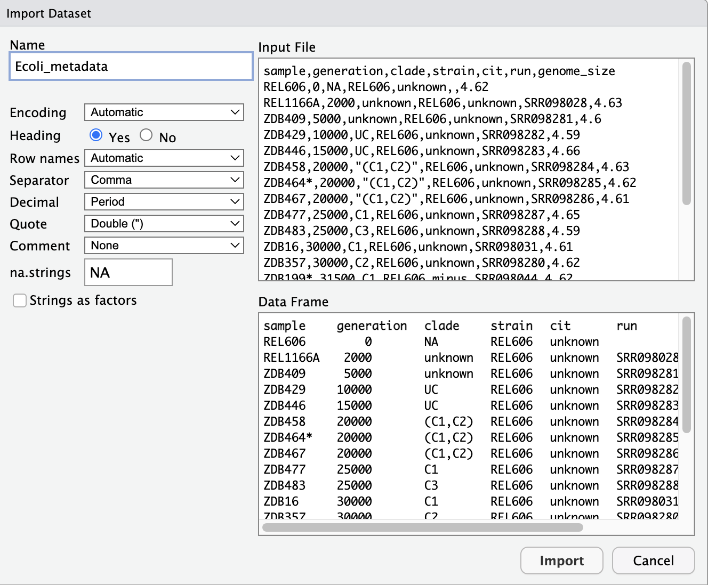

Importing and Manipulating Data Frames
=========================


Using data in data frames
=========================

> Learning Objectives
> -------------------
> 
> *   Load external tabular data from a .csv file into R.
> *   Describe what an R data frame is.
> *   Summarize the contents of a data frame in R.

* * *

Looking at Metadata
===================

We are studying a population of Escherichia coli (designated Ara-3), which were propagated for more than 40,000 generations in a glucose-limited minimal medium. This medium was supplemented with citrate which E. coli cannot metabolize in the aerobic conditions of the experiment. Sequencing of the populations at regular time points reveals that spontaneous citrate-using mutants (Cit+) appeared at around 31,000 generations. This metadata describes information on the Ara-3 clones. Read more about the Long Term Evolution Experiment [here](https://the-ltee.org/about/) from Lenski. 

The metadata file required for this lesson can be [downloaded directly here](https://raw.githubusercontent.com/datacarpentry/R-genomics/gh-pages/data/Ecoli_metadata.csv). This data was taken from the Blount et al. paper in [Nature](https://www.nature.com/articles/nature11514).

The columns stand for: 

| Column      | Description                                |
| ----------- | ------------------------------------------ |
| sample      | clone name                                 |
| generation  | generation when the sample was frozen      |
| clade       | based on parsimony-based tree              |
| strain      | ancestral strain                           |
| cit         | citrate-using mutant status                |
| run         | Sequence read archive sample ID            |
| genome_size | size in Mbp (made up data for this lesson) |


> Hint: If you can’t find the Ecoli\_metadata.csv file, or have lost track of it, download the file directly using the R `download.file() function`
> Hint: Make sure you make a new folder to save the new Ecoli_metadata.csv file. 

    download.file("https://raw.githubusercontent.com/datacarpentry/R-genomics/gh-pages/data/Ecoli_metadata.csv", "data/Ecoli_metadata.csv")


# Two methods to import data 
## Using the visual IDE 

1) Select `File --> Import Dataset --> From Text (base)...`

2) Navigate to where you have downloaded your Ecoli_metadata.csv file.

3) It should look like the image below. Please try out the different settings. 


4) This will automatically run the import in the console. Please make sure you copy and paste into your R script. 

## Directly in the console
You are now ready to load the data. We are going to use the R function `read.csv()` to load the data file into memory (as a `data.frame`):
```
    metadata <- read.csv('data/Ecoli_metadata.csv')
```
This statement doesn’t produce any output because the assignment doesn’t display anything. If we want to check that our data has been loaded, we can print the variable’s value: `metadata`

Let’s check the top (the first 6 lines) of this `data.frame` using the function `head()`:

```
    head(metadata)

    ##     sample generation   clade strain     cit       run genome_size
    ## 1   REL606          0    <NA> REL606 unknown                  4.62
    ## 2 REL1166A       2000 unknown REL606 unknown SRR098028        4.63
    ## 3   ZDB409       5000 unknown REL606 unknown SRR098281        4.60
    ## 4   ZDB429      10000      UC REL606 unknown SRR098282        4.59
    ## 5   ZDB446      15000      UC REL606 unknown SRR098283        4.66
    ## 6   ZDB458      20000 (C1,C2) REL606 unknown SRR098284        4.63

```
We’ve just done two very useful things. 

1. We’ve read our data in to R, so now we can work with it in R

2. We’ve created a data frame (with the read.csv command) in the standard way R works with data.


## Debugging errors 
Let's create a very common error you might encounter. 
```
    (metadata <- read.csv('dataa/Ecoli_metadata.csv'))
```

```
    Error in file(file, "rt") : cannot open the connection
    In addition: Warning message:
    In file(file, "rt") :
        cannot open file 'dataa/Ecoli_metadata.csv': No such file or directory
```


> Exercise
> --------
> On your table can you please try to create a unique error message? 
> 


# What to do when you get an error
1. Don't panic - you are not special
2. First read the error message - what does it say 
3. Next, check your code for easily done errors (a) matched brackets (b) matched quotation marks (c) correct names 
4. Then google the error message. However, this doesn’t always work very well because often, package developers rely on the error catching provided by R. 
5. You end up with general error messages that might not be very helpful to diagnose a problem (e.g. “subscript out of bounds”).
6. However, you should check stackoverflow.com. Search using the [r] tag. Most questions have already been answered, but the challenge is to use the right words in the search to find the answers: http://stackoverflow.com/questions/tagged/r


What are data frames?
=====================

A `data.frame` is a collection of vectors of identical lengths. Each vector represents a column, and each vector can be of a different data type (e.g., characters, integers, factors). The `str()` function is useful for inspecting the data types of the columns.

By default, `data.frame` coerce) columns that contain characters (i.e., text) into the `factor` data type. Depending on what you want to do with the data, you may want to keep these columns as `character`. To do so, `read.csv()` and `read.table()` have an argument called `stringsAsFactors` which can be set to `FALSE`:

Let’s now check the structure of this `data.frame` in more details with the function `str()`:

```
    str(metadata)
```

Inspecting `data.frame` objects
===============================

We already saw how the functions `head()` and `str()` can be useful to check the content and the structure of a `data.frame`. Here is a non-exhaustive list of functions to get a sense of the content/structure of the data.

*   Size:
    *   `dim()` - returns a vector with the number of rows in the first element, and the number of columns as the second element (the dimensions of the object)
    *   `nrow()` - returns the number of rows
    *   `ncol()` - returns the number of columns
*   Content:
    *   `head()` - shows the first 6 rows
    *   `tail()` - shows the last 6 rows
*   Names:
    *   `names()` - returns the column names (synonym of `colnames()` for `data.frame` objects)
    *   `rownames()` - returns the row names
*   Summary:
    *   `str()` - structure of the object and information about the class, length and content of each column
    *   `summary()` - summary statistics for each column

Note: most of these functions are “generic”, they can be used on other types of objects besides `data.frame`.


> Challenge
> --------
> Based on the given table of functions to asses data structure, can you answer the following questions?
> 
> 1) What is the class of the object metadata?
>    
> 2) How many rows and how many columns are in this object?
>    
> 3) What are the column names for this data frame?


Subsetting Data frames
------------------

The metadata data frame has rows and columns (it has 2 dimensions), if we want to extract some specific data from it, we need to specify the “coordinates” we want from it. Row numbers come first, followed by column numbers (i.e. \[row, column\]).

    metadata[1, 2]   # 1st element in the 2nd column 
    metadata[1, 6]   # 1st element in the 6th column
    metadata[1:3, 7] # First three elements in the 7th column
    metadata[3, ]    # 3rd element for all columns
    metadata[, 7]    # Entire 7th column


# Using column names to subset data frames

For larger datasets, it can be tricky to remember the column number that corresponds to a particular variable. 
Sometimes the column number for a particular variable can change if your analysis adds or removes columns. 
The best practice when working with columns in a data frame is to refer to them by name. This also makes your code easier to read and your intentions clearer.

There are two ways to select a column by name from a data frame:

*   Using `dataframe[ , "column_name"]`
*   Using `dataframe$column_name`

You can do operations on a particular column, by selecting it using the `$` sign. 

In this case, the entire column is a vector.
To see the possible columns names run
```
    names(metadata)
    colnames(metadata)

```

To subset just the strain column from the metadata or
```
    metadata[ , "strain"]
    
    metadata$strain

```

The first method allows you to select multiple columns at once. Suppose we wanted strain and clade information:

    metadata[, c("strain", "clade")]

You can even access columns by column name _and_ select specific rows of interest. For example, if we wanted the strain and clade of just rows 4 through 7, we could do:

    metadata[4:7, c("strain", "clade")]


> Exercise
> ===========
> Create a new variable of a dataframe that contains just the sample and genome size. 
> 
> Why would you create a subset of the original dataframe?
> 


Factors
-------
In the data frame we just imported, let’s do:
```
    str(metadata)
```

As you can see, many of the columns in our data frame are character datatypes. However, there is also a special class called `factor`. 

They are very useful but not necessarily intuitive and therefore require some attention.

Factors are used to represent categorical data. Factors can be ordered or unordered. They are an important class for statistical analysis and for plotting.

Factors are:
- stored as integers
- have labels associated with these unique integers.
- While factors look (and often behave) like character vectors, they are actually integers under the hood, and you need to be careful when treating them like strings.

Let us convert the clade columns from a character to a factor column using the `factor` command.

```
    factor(metadata[,3])
```

We can see the levels associated with this factor are: `Levels: (C1,C2) C1 C2 C3 Cit+ UC unknown`. 

> Exercise
> ===========
> Let's reread in our metadata data frame, but set every character column to be a factor.
> 
> By looking at the help page can you edit the command below with a new arguement that would read in all strings as factors?
> 
> ```
>    metadata <- read.csv('data/Ecoli_metadata.csv')
> ```

Once created, factors can only contain a pre-defined set of values known as _levels_. By default, R always sorts _levels_ in alphabetical order.

For instance, we see that `cit` is a Factor w/ 3 levels, `minus`, `plus` and `unknown`.


****
Material adapted from (https://datacarpentry.org/R-genomics/01-intro-to-R.html) and (https://datacarpentry.org/semester-biology/materials/r-intro/)
