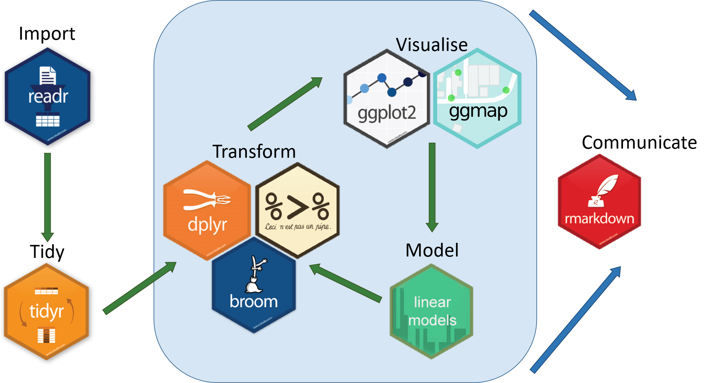

Preparing your data for analysis
=====================

> Learning Objectives
> -------------------
> 

> * Understand why you need to perform data manipulation and how the tidyverse family of R packages can help
> * Install and load the dplyr package
> * Apply common tidyverse functions to manipulate data in R
> * Utilise the ‘pipe’ operator to link together a sequence of functions.
> * Utilise the ‘mutate’ function to apply other chosen functions to existing columns and create new columns of data.
> * Apply the ‘split-apply-combine’ concept to split the data into groups, apply analysis to each group, and combine the results
> * Save the output of your data manipulation results


# Installing packages 
The "tidyverse" is a collection of packages that has been developed to help with manipulating and better presenting data. In this course, we are focusing on dplyr and ggplot that have their own unique roles visualised below. `dplyr` is a package for making data manipulation easier.



The functions we have used so far have all been part of "base R" meaning that we haven't had to load any new packages. Packages are collections of related functions that are generally used together (eg ggplot has functions related to making plots)

To get access to a new R packages, you need to install the package using a function like `install.packages()` and then load it using `library()` to be able to use it. The main places that you can get R packages from (called repositories) are CRAN and Bioconductor. For newer packages and newer versions of packages, you may need to install them from GitHub instead.

```
## To install a package from the main repository (CRAN), we can use the following function
install.packages("dplyr") ## install
```
You might get asked to choose a CRAN mirror – this is basically asking you to choose a site to download the package from. The choice doesn’t matter too much; I’d recommend choosing the RStudio mirror.

    library("dplyr")          ## load

You only need to install a package once, but you need to load it every time you open a new R session and want to use that package.

> Hint: Some libraries are not available via the `install.packages` function, especially Bioconductor. For example, DESeq2 used for differential expression analysis  (https://bioconductor.org/packages/release/bioc/html/DESeq2.html). To do this copy the code into the console.
> 
> This is for demonstration purposes only so you do not need to run this as we are not running differential expression analysis in this workshop
> ```
> if (!require("BiocManager", quietly = TRUE))
>   install.packages("BiocManager")
>
> BiocManager::install("DESeq2")
> ```

What is dplyr?
--------------

Data manipulation is the process of getting your data into a state that you can use for downstream analyses (eg subsetting, merging columns together). The package `dplyr` was developed to make it easier to do many of the most common data manipulation tasks. 
It is built to work directly with data frames. 

### Load Metadata CSV File
Please rerun the command from Monday's session. This might be different depending on where you are within your directory. 

```
metadata <- read.csv("data/Ecoli_metadata.csv", stringsAsFactors = TRUE)
```

### Selecting columns and filtering rows

We’re going to learn some of the most common `dplyr` functions: `select()`, `filter()`, `mutate()`, `group_by()`, and `summarize()`. To select columns of a data frame, use `select()`. The first argument to this function is the data frame (`metadata`), and the subsequent arguments are the columns to keep.
```
select(metadata, sample, clade, cit, genome_size)
```

To choose rows, use `filter()`:

```
filter(metadata, cit == "plus")
```

### Pipes

But what if you wanted to select and filter? There are three ways to do this: use intermediate dataframes, nested functions or finally, pipes.

 - By forming <b>intermediate data frames</b>, you create a temporary data frame and use that as input to the subsequent function. This can clutter up your workspace with lots of objects.
 - You can also <b>nest functions</b> (i.e. one function inside of another). This is handy but can be difficult to read if too many functions are nested.
 -   The last option, pipes, takes one function's output and sends it directly to the next. This is useful when you need apply different filtering or functions to the same data set. Pipes in R look like `%>%` and are made available via the `magrittr` package. We actually installed it as part of `dplyr`. This is an example of a package dependency, meaning that dplyr can only be installed if a list of other packages are installed as well. Some packages such as Seurat have a very long list of dependencies so they can be quite time-consuming to install

First, we are <i>piping</i>. Piping is the standard way of using the tidyverse family of packages.
```
metadata %>%
    filter(cit == "plus")
```
```
metadata %>%
    filter(cit == "plus") %>%
    select(sample, generation, clade)
```

In the above, we use the pipe to send the `metadata` data set first through `filter` to keep rows where `cit` was equal to ‘plus’, and then through `select` to keep the `sample` and `generation` and `clade` columns. 

When the data frame is being passed to the `filter()` and `select()` functions through a pipe, we no longer need to include it as an argument to these functions.

If we wanted to create a new object with this smaller version of the data, we could do so by assigning it a new name:

```
meta_citplus <- metadata %>%
      filter(cit == "plus") %>%
      select(sample, generation, clade)
```

> ### Exercise
> ======
> 
> Using pipes, subset the data to include rows where the clade is ‘Cit+’. Retain columns `sample`, `cit`, and `genome_size.`

### Mutate

Frequently you’ll want to create new columns based on the values in existing columns, for example to do unit conversions or find the ratio of values in two columns. For this we’ll use `mutate()`.

To create a new column of genome size in bp:
```
metadata %>%
    mutate(genome_bp = genome_size *1e6)
```

If this runs off your screen and you just want to see the first few rows, you can use a pipe to view the `head()` of the data (pipes work with non-dplyr functions too, as long as the `dplyr` or `magrittr` packages are loaded).
```
metadata %>%
    mutate(genome_bp = genome_size *1e6) %>%
    head
```
You can also use the `glimpse()` function. This shows the column names on the left and the column contents as rows so it can be easier to see if you have lots of columns
```
metadata %>%
    mutate(genome_bp = genome_size *1e6) %>%
    glimpse()
```


The row has a NA value for clade, so if we wanted to remove those we could insert a `filter()` in this chain:
```
metadata %>%
    mutate(genome_bp = genome_size *1e6) %>%
    filter(!is.na(clade)) %>%
    head
```

`is.na()` is a function that determines whether something is or is not an `NA`. The `!` symbol negates it, so we’re asking for everything that is not an `NA`.

Note: `head()` is a base R function rather than a tidyverse package function. You can use base R functions within pipes as well

> Exercise
> --------
> Using pipes, visualise the last few rows using the function `tail` of the data manipulated above.
>

### Split-apply-combine data analysis and the summarize() function

Many data analysis tasks can be approached using the “split-apply-combine” paradigm.
1. split the data into groups
2. apply some analysis to each group
3. then combine the results.
  

`dplyr` makes this very easy through the use of the `group_by()` function, which splits the data into groups. When the data is grouped in this way, `summarize()` can be used to collapse each group into a single-row summary. `summarize()` does this by applying an aggregating or summary function to each group. For example, if we wanted to group by citrate-using mutant status and find the number of rows of data for each status, we would do:

```
metadata %>%
    group_by(cit) %>%
    summarize(n())
```

Here the summarising function used was `n()` to find the count for each group. 

We can also apply many other functions to individual columns to get other summary statistics. For example, in the R base package, we can use built-in functions like `mean`, `median`, `min`, and `max`. 

By default, all **R functions operating on vectors that contain missing data will return NA**. It’s a way to make sure that users know they have missing data, and make a conscious decision on how to deal with it. When dealing with simple statistics like the mean, the easiest way to ignore `NA` (the missing data) is to use `na.rm=TRUE` (`rm` stands for remove).

So to view mean `genome_size` by mutant status:

```
metadata %>%
    group_by(cit) %>%
    summarize(mean_size = mean(genome_size, na.rm = TRUE))
```

You can group by multiple columns too:

```
metadata %>%
    group_by(cit, clade) %>%
    summarize(mean_size = mean(genome_size, na.rm = TRUE))
```

Looks like for one of these clones, the clade is missing. We could then discard those rows using `filter()`:

```
metadata %>%
    group_by(cit, clade) %>%
    summarize(mean_size = mean(genome_size, na.rm = TRUE)) %>%
    filter(!is.na(clade))
```

All of a sudden, the results are not running off the screen anymore. That’s because `dplyr` has changed our `data.frame` to a `tbl_df`. 

This is a data structure that’s very similar to a data frame; for our purposes the only difference is that it won’t automatically show tons of data going off the screen.

You can also summarize multiple variables at the same time:
```
summarise_metadata <- metadata %>%
    group_by(cit, clade) %>%
    summarize(mean_size = mean(genome_size, na.rm = TRUE),
              min_generation = min(generation))
```
Look at [Handy dplyr cheatsheet](https://github.com/rstudio/cheatsheets/blob/main/data-transformation.pdf) for more possibilities with the dplyr package.

> Exercise
> --------
> Using the cheatsheet above,
> 1) Can you randomly select 3 rows from metadata?
> 
> 2) Can you group by the cit and find the mean generation number across the groups?
>
>

### Exporting your results 
The goal is to export our processed dataset to a CSV file. We will firstly create a new folder called results for putting our outputs in. It is always a good idea to have some separation between input and output data
We will use the `write.csv` function which takes two arguments: the data frame you want to export and the location. 

```
## create a results folder for outputs
dir.create("results")
## save your file as a csv
write.csv(summarise_metadata, "results/summarised_metadata.csv")

```

#### Exporting your results in rds and qs formats
If you have tabular data, then it often makes sense to export it in the csv format that can be loaded in excel. In other situations like lists, Seurat objects, or other more complex data types it is often necessary to save them in other formats. Here are examples of how to save files as `rds` and `qs` objects. The `qs` package (now updated to `qs2`) was developed to make it faster to load and save R objects so it is the better option if you have larger files (>100mb or more)

```
## To save the file as an rds file you use the saveRDS function (base R)
saveRDS(summarise_metadata, "results/summarised_metadata.rds")

## To load it back in you would run
# summarise_metadata <- readRDS("results/summarised_metadata.rds")

### Optional : Demonstration of how to use the qs2 package
## To save in the qs file format, you first need to install the qs2 package from CRAN (this is the 2026 update of the original qs package)
#install.packages("qs2")
#library(qs2)
#qs_save(summarise_metadata, "results/summarised_metadata.qs")

## 
#summarise_metadata <- qs_read("results/summarised_metadata.qs")

```

## Appendix - What if my data is a mess?

As this is an introductory course, we are using a 'clean' dataset that does not have many issues with it. In the real world, your input dataset may have common issues such as;

1. Inconsistent capitalisation
2. Inconsistent delimiters or separators `("Control-1","Control_1","Control 1")` : avoid separators that have functions in R (e.g the hyphen `-` is used for subtraction)
3. Typos
4. Leading whitespace (`" Control_1"` instead of `"Control_1"`)
5. Trailing whitespace (`"Control_1 "` instead of `"Control_1"`)
6. Missing values

The best approach is to be rigorous in how you prepare your input data before bringing it into R but sometimes this is outside of your control. Generally speaking it is better to leave the raw data as is and then apply data manipulation steps within R

### Let's make a new dataframe that is a mess
Run the code below to make a new dataframe called clinical data that has some examples of real-world issues
```

clinical_data <- data.frame(participant_ID = factor(c("Patient_1", "patient_1", "Patient 2", "patient2", "Patint_3", "Patient_3", "patient_4", "Patient 4", "PATIENT_5","Patient_5","patient6", "Patient_6", "Patient_7", "patient_7", "Patient 8", "patient_8", "Patint_9", "patient 10", "Patient_11","PATIENT_12")),
  sample_type = factor(c("Normal", " Tumour", "NORMAL", "tumour", "Normal ", " Tumour", "Normal", "TUMOUR", "Normal", "tumour "," normal", "tumour ", "Normal", " Tumour", "normal", "Tumour", "Normal", "Tumour", " Normal", "Tumour")),
  chemotherapy = factor(c("Cisplatin", "Cisplatin", "Carboplatin", "Carboplatin", "Paclitaxel", "Paclitaxel", "Doxorubicin", "Doxorubicin","Cisplatin", "Cisplatin","Carboplatin", "Carboplatin", "Paclitaxel", "Paclitaxel", "Doxorubicin", "Doxorubicin", "Cisplatin", "Carboplatin","Paclitaxel", "Doxorubicin")),
  tumour_grade = c(NA, 2, NA, 3, NA, 2, NA, 4, NA, 3,NA, 2, NA, 3, NA, 4, NA, 3, NA, 4),
  tumour_size_mm = c(NA, 15.3, NA, 22.1, NA, 18.5, NA, 31.6, NA, 24.8,NA, 19.7, NA, 27.3, NA, 35.1, NA, 21.5, NA, 28.9))

## inspect the dataframe
summary(clinical_data)
# participant_ID  sample_type    chemotherapy      tumour_grade   tumour_size_mm 
# patient 10: 1     Normal :5    Carboplatin:5     Min.   :2.00   Min.   :15.30  
# Patient 2 : 1      Tumour:3    Cisplatin  :5     1st Qu.:2.25   1st Qu.:20.15  
# Patient 4 : 1     Tumour :3    Doxorubicin:5     Median :3.00   Median :23.45  
# Patient 8 : 1     tumour :2    Paclitaxel :5     Mean   :3.00   Mean   :24.48  
# patient_1 : 1      normal:1                      3rd Qu.:3.75   3rd Qu.:28.50  
# Patient_1 : 1      Normal:1                      Max.   :4.00   Max.   :35.10  
# (Other)   :14     (Other):5                      NA's   :10     NA's   :10 

```

### Now let's run a series of steps to clean it up

<b>Load required packages and convert factor variables to character</b>

```
## load require packages for the cleaning steps
library(dplyr)
library(stringr) # install using install.packages("stringr") if you need to
## any function starting with str_ comes from the "stringr" package

## firstly convert any factor variables back to character
clinical_data <- clinical_data %>%
    mutate(across(where(is.factor), as.character))

## confirm that the first 3 columns are now characters
summary(clinical_data)
# participant_ID     sample_type        chemotherapy        tumour_grade  tumour_size_mm 
# Length:20          Length:20          Length:20          Min.   :2.00   Min.   :15.30  
# Class :character   Class :character   Class :character   1st Qu.:2.25   1st Qu.:20.15  
# Mode  :character   Mode  :character   Mode  :character   Median :3.00   Median :23.45  
#                                                          Mean   :3.00   Mean   :24.48  
#                                                          3rd Qu.:3.75   3rd Qu.:28.50  
#                                                          Max.   :4.00   Max.   :35.10  
#                                                          NA's   :10     NA's   :10  


```

<b>Run a piped step that removes white space, makes capitalisation consistent,replaces spaces with underscores,corrects a recurring typo, and returns a cleaned dataframe</b>

```
clinical_data_clean <- clinical_data %>%
    # remove leading and trailing whitespace using the str_trim function from stringr
    mutate(across(where(is.character), str_trim)) %>%

    # standardise capitalisation by making everything lower case
    mutate(across(where(is.character), str_to_lower)) %>%

    # standardise separators in participant_ID
    # this removes all spaces and replaces them with an underscore
    mutate(participant_ID = str_replace_all(participant_ID, pattern=" ",replacement= "_")) %>%

    # replace typos of "patint" with "patient" in the participant_ID column
    # you can use this to correct frequently occurring typos
    mutate(participant_ID = str_replace_all(participant_ID, pattern="patint", replacement="patient"))
```

<b>Check the output</b>
```
#check remaining NA values per column (it should be the same as before)
clinical_data_clean %>% summarise(across(everything(), ~ sum(is.na(.))))

# Check the patient ID column
summary(factor(clinical_data_clean$participant_ID))
# patient_1 patient_10 patient_11 patient_12  patient_2  patient_3  patient_4  patient_5  patient_6  patient_7 
#     2          1          1          1          1          2          2          2          1          2 
# patient_8  patient_9   patient2   patient6 
#     2          1          1          1 

# Most problems have been fixed but some patients only have 1 sample and there
# are two patients that do not have an underscore before the number;
# "patient_2" and "patient2", "patient_6" and "patient 6"

```
<b>Correct the individual values that do not have an underscore. Here we will demonstrate how to do it using base R</b>
> Extra exercise: You can think of how you could do the same thing using dplyr

```
## We are treating the column as a vector, selecting the part of it that is 
## incorrect, and assigning the correct value (note that this will only work
## if the column is a character variable - see footnote).

clinical_data_clean$participant_ID[clinical_data_clean$participant_ID=="patient2"] <- "patient_2"
clinical_data_clean$participant_ID[clinical_data_clean$participant_ID=="patient6"] <- "patient_6"

### confirm that there are now 2 values for "patient_2" and "patient_6"
summary(factor(clinical_data_clean$participant_ID))
#
# expected output
# patient_1 patient_10 patient_11 patient_12  patient_2  patient_3  patient_4  patient_5  patient_6  patient_7 
#         2          1          1          1          2          2          2          2          2          2 
# patient_8  patient_9 
#         2          1 

## Footnote
## Not required. It is a demonstration of how to convert a column to a character
#clinical_data_clean$participant_ID <- as.character(clinical_data_clean$participant_ID)

```
<b>You may want to add a column after cleaning to indicate subjects with complete data (eg participants with both tumour and normal samples)</b>

```
## use dplyr to add a logical column called has_paired_samples_dplyr
## for if a participant has a normal AND a tumour sample

clinical_data_clean <- clinical_data_clean %>%
    group_by(participant_ID) %>%
    mutate(has_paired_samples_dplyr = all(c("normal", "tumour") %in% sample_type)) %>%
    ungroup()
## check the output    

## get the same output using base R instead    
clinical_data_clean$has_paired_samples_baseR <- ave(
    clinical_data_clean$sample_type,
    clinical_data_clean$participant_ID,
    FUN = function(x) all(c("normal", "tumour") %in% x)
  ) == "TRUE"

## Compare the outputs using the table function  
table(baseR=clinical_data_clean$has_paired_samples_baseR,dplyr=clinical_data_clean$has_paired_samples_dplyr)

#         dplyr
# baseR   FALSE TRUE
#   FALSE     4    0
#   TRUE      0   16

## this shows that the same 4 rows were false for baseR and dplyr and that the
## same 16 rows were false for baseR and dplyr

```
<b>Think of any further checks that it would be good to do and how you would do them</b>
> E.g. Normal tissue should not have a tumour size

****
This lesson was copied or adapted from Jeff Hollister’s [materials](http://usepa.github.io/introR/2015/01/14/03-Clean/)
Material adapted from (<https://datacarpentry.org/R-genomics/01-intro-to-R.html>) and (<https://datacarpentry.org/semester-biology/materials/r-intro/>) by Helen King. Further revisions by the Data Science Platform.


