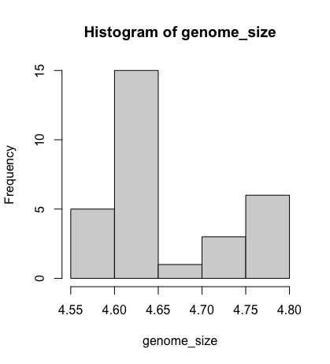
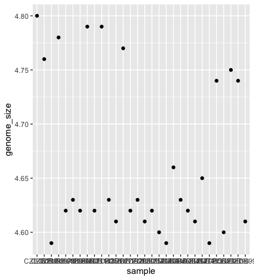
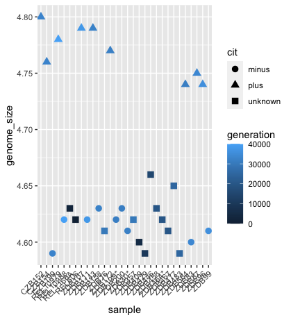
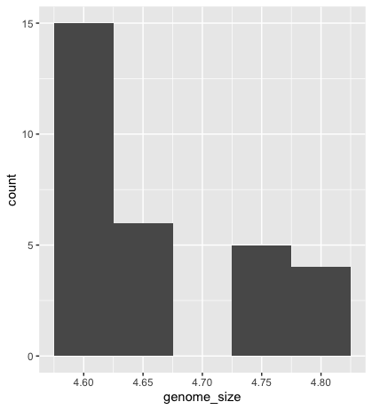
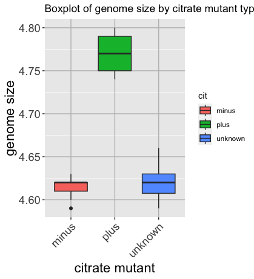
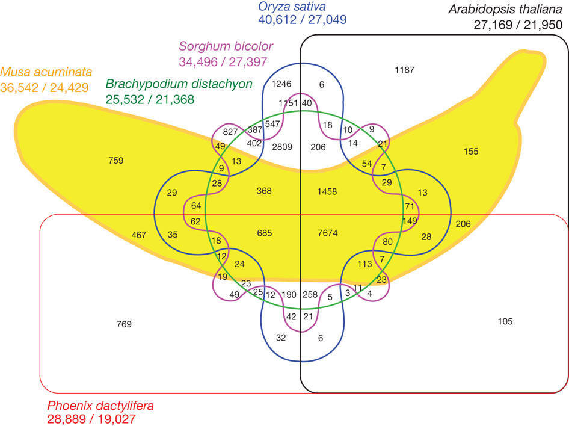
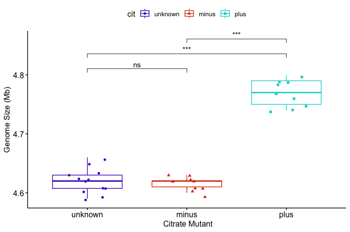

Data Visualisation using ggplot
===================================
> Learning Objectives
> -------------------
> 
> *   Understand that there is basic R plotting (histograms) and more popular ggplot2 package plots (for everything else).
> *   Be able to shape data into the correct format for making your desired plot.
> *   Customise the aesthetics of an existing plot.
> *   Export plots from RStudio to standard graphical file formats.

Basic plots in R (Histogram)
============================

The mathematician Richard Hamming once said, “The purpose of computing is insight, not numbers”, and the best way to develop insight is often to visualise data. Visualisation deserves an entire lecture (or course) of its own, but we can explore a few features of R’s plotting packages.

When we are working with large sets of numbers, it can be useful to display that information graphically. R has several built-in tools for basic graph types such as histograms, scatter plots, bar charts, boxplots and much [more](http://www.statmethods.net/graphs/). 

However, for most people, you would only use the histogram function in base R plots. We will test that out on the genome size of our metadata.

    genome_size <- metadata$genome_size

We can do this by using the `hist` function:
```
    hist(genome_size)
```



Advanced figures (`ggplot2`)
============================

More recently, R users have shifted away from base graphic options and toward a plotting package called [`ggplot2`](http://docs.ggplot2.org/), which adds significant functionality to the basic plots seen above. The syntax takes some getting used to but it’s extremely powerful and flexible. Let's try out a basic scatterplot.

`ggplot2` is best used on data in the `data.frame` form, so we will work with `metadata` for the following figures. Let’s start by loading the `ggplot2` library.
```
    library("ggplot2")
```

The `ggplot()` function is used to initialise the basic graph structure, and then we add to it. The basic idea is that you specify different parts of the plot and add them together using the `+` operator.

We will start with a blank plot and add layers as we progress.
```
    ggplot(metadata)
```

Geometric objects are the actual marks we put on a plot. Examples include:

*   points (`geom_point`, for scatter plots, dot plots, etc)
*   lines (`geom_line`, for time series, trend lines, etc)
*   boxplot (`geom_boxplot`, for, well, boxplots!)

A plot **must have at least one geom**; there is no upper limit. You can add a geom to a plot using the + operator
```
    ggplot(metadata) +
      geom_point() 
```

Each type of geom usually has a **required set of aesthetics** to be set, and usually accepts only a subset of all aesthetics – refer to the geom help pages to see what mappings each geom accepts. 


Aesthetic mappings are set with the aes() function. Examples include:
*   position (i.e., on the x and y axes)
*   colour (“outside” colour)
*   fill (“inside” colour) shape (of points)
*   line type
*   size

To start, we will add the column names that correspond to the variable we want to set for the x- and y-values.
`geom_point` requires arguments for x and y, all other arguments are optional.
We will run the most basic scatterplot of `sample` against `genome size`.
```
    ggplot(metadata) +
      geom_point(aes(x = sample, y= genome_size))
```


The problem is that the labels on the x-axis are quite hard to read. To change this, we need to add a theme layer. The ggplot2 `theme` system handles non-data plot information such as:

*   Axis labels
*   Plot background
*   Facet label background
*   Legend appearance

We have built-in themes to use, or we can adjust specific elements. 


For our figure, we will change the x-axis labels to be plotted on a 45-degree angle with a small horizontal shift to avoid overlap. 

We will also add some additional aesthetics by assigning them to other variables in our dataframe. 

_For example, the colour of the points will reflect the number of generations and the shape will reflect citrate mutant status._ The size of the points can be adjusted within the `geom_point` but does not need to be included in `aes()` since the value is not assigned to a variable.
```
    ggplot(metadata) +
      geom_point(aes(x = sample, y= genome_size, color = generation, shape = cit), size = rel(3.0)) +
      theme(axis.text.x = element_text(angle=45, hjust=1))
```


Histogram
---------

To plot a histogram, we require another geometric object, `geom_bar`, which requires a statistical transformation. Some plot types (such as scatterplots) do not require transformations; each point is plotted at x and y coordinates equal to the original value. Other plots, such as boxplots and histograms, as well as prediction lines, require transformation and typically have a default statistic that can be modified via the `stat_bin` argument.
```
    ggplot(metadata) +
      geom_histogram(aes(x = genome_size))
```

Could you try plotting with the default value and compare it to the plot using the binwidth values? How do they differ?

```
    ggplot(metadata) +
      geom_bar(aes(x = genome_size), stat = "bin", binwidth=0.05)
```





Please explore the different options found on the [cheatsheet](https://www.maths.usyd.edu.au/u/UG/SM/STAT3022/r/current/Misc/data-visualization-2.1.pdf)


> Exercise
> --------
> Go to the [R Gallery](https://r-graph-gallery.com/). Choose your favourite histogram. Change the colour of the histogram to red. Should this be within the `aes()` function, or outside?
> 
>  **Hint** Look at the cheatsheet


Boxplot
-------

Now that we have all the required information, let’s try plotting a boxplot similar to what we had done using the base plot functions at the start of this lesson. 

We can add some additional layers to include a plot title and change the axis labels. 


Please take a look at the code below and the various layers we have added to understand the contributions of each layer to the final graphic.
```
    ggplot(metadata) +
      geom_boxplot(aes(x = cit, y = genome_size, fill = cit)) +
      ggtitle('Boxplot of genome size by citrate mutant type') +
      xlab('citrate mutant') +
      ylab('genome size') +
      theme(panel.grid.major = element_line(color = "grey"),
              axis.text.x = element_text(angle=45, hjust=1),
              axis.title = element_text(size = rel(1.5)),
              axis.text = element_text(size = rel(1.25)))
```


> Exercise
> --------
> Check out other options using the [r-graph gallery](https://r-graph-gallery.com/264-control-ggplot2-boxplot-colors.html).
> 

Writing figures to a file
=======================

There are two ways in which figures and plots can be output to a file (rather than simply displaying on screen). The first (and easiest) is to export directly from the RStudio ‘Plots’ panel, by clicking on `Export` when the image is plotted. This will give you the option of `png` or `pdf` and selecting the directory to which you wish to save it to.

The second option is to use R functions in the console, allowing you the flexibility to specify parameters to dictate the size and resolution of the output image. Some of the more popular formats include `pdf()`, `png()`, which are functions that initialise a plot that will be written directly to a file in the `pdf` or `png` format, respectively. Within the function, you will need to specify a name for your image in quotes and the width and height. Specifying the width and height is optional, but can be very useful if you are using the figure in a paper or presentation and need it to have a particular resolution. Note that the default units for image dimensions are either pixels (for png) or inches (for pdf). To save a plot to a file, you need to:

1.  Initialise the plot using the function that corresponds to the type of file you want to make: `pdf("filename")`
2.  Write the code that makes the plot.
3.  Close the connection to the new file (with your plot) using `dev.off()`.

```
    pdf("figure/boxplot.pdf")
    
    ggplot(example_data) +
      geom_boxplot(aes(x = cit, y =....) +
      ggtitle(...) +
      xlab(...) +
      ylab(...) +
      theme(panel.grid.major = element_line(...),
              axis.text.x = element_text(...),
              axis.title = element_text(...),
              axis.text = element_text(...)
    
    dev.off()

```


> Exercise
> --------
> Make the ugliest plot you can! Hint: if you can make it uglier than Katherine's favourite graph, I will be impressed
> 


Integrating statistical tests into your plot
--------------------------------------
Utilise [ggpubr](https://rpkgs.datanovia.com/ggpubr/) to make it easier to interact with ggplot and integrate statistics. Different statistical tests are appropriate depending on the number of groups and the distribution of the data within the groups. 

This isn’t a statistics class, so we won’t cover all available methods. However, we'll walk through the logic for choosing a suitable test for this dataset.

### Step-by-step: Choosing the appropriate test:

1. Data type.
   i. genome_size is numeric.
   ii. cit is a categorical variable with three levels: "plus", "minus", and "unknown".

2. What are we comparing?
   i. We're interested in whether genome size differs between citrate-utilisation groups (cit status).
   ii. We will perform pairwise comparisons: "minus" vs "plus", "unknown" vs "plus" and "minus" vs "unknown".

3. Group sizes. These are relatively small sample sizes.

 `table(metadata$cit)`
  minus    plus unknown 
      9       9      12 

4. Data distribution and normality. While formal normality tests (e.g., shapiro.test() or ks.test()) can be used, small sample sizes and the presence of tied values (e.g., repeated 4.62, 4.63) already suggest that the data likely violate normality assumptions. The standard deviations are small, and visual inspections show limited spread within each group.

Choosing the test because:
- The data are numeric
- The group sizes are small
- There are tied values and limited variance
- And we are comparing group medians across pairs of groups.

We choose the Wilcoxon rank-sum test (a non-parametric alternative to the t-test) for pairwise comparisons.
For testing across all three groups simultaneously, we would use the Kruskal–Wallis test; however, that’s not necessary here, as we're interested in pairwise differences.

For visualisation, you'll need to install the ggubr package, load it into your library, and plot your boxplot. 

```
    # Install and load ggpubr
    install.packages("ggpubr")
    library(ggpubr)
    
    # Visualise with a boxplot
    p <- ggboxplot(metadata, x = "cit", y = "genome_size",
                   color = "cit",
                   palette = c("#4D00C7", "#DA3C07", "#05D3D3", "#C6C7C5"),
                   add = "jitter", shape = "cit") +
         xlab("Citrate Mutant") + ylab("Genome Size (Mb)")
    
    # Define pairwise comparisons
    my_comparisons <- list(
      c("unknown", "minus"),
      c("unknown", "plus"),
      c("minus", "plus")
    )
    
    # Add Wilcoxon test results with significance labels
    p + stat_compare_means(
          comparisons = my_comparisons,
          method = "wilcox.test",
          aes(label = after_stat(p.signif)),
          exact = FALSE  # avoid warning with ties
      )
```


> 


You might get a warning:

```
Warning messages:
1: In wilcox.test.default(...):
  cannot compute exact p-value with ties
  ```

This occurs because the Wilcoxon rank-sum test (also called the Mann–Whitney U test) attempts to compute an exact p-value by default. However, this method assumes that all values are unique. When your data contains tied values—as is the case here with repeated measurements like 4.62 and 4.63—the exact method is no longer valid. In such cases, the test automatically switches to an approximate method (based on a normal approximation) and raises this warning.


Resources:
----------

We have only scratched the surface here. To learn more, see the [ggplot2 reference site](http://docs.ggplot2.org/), and Winston Chang’s excellent [Cookbook for R](http://wiki.stdout.org/rcookbook/Graphs/) site. 

Though slightly out of date, [ggplot2: Elegant Graphics for Data Analysis](http://www.amazon.com/ggplot2-Elegant-Graphics-Data-Analysis/dp/0387981403) is still the definitive book on this subject. Much of the material here wasadaptedd from [Introduction to R graphics with ggplot2 Tutorial at IQSS](http://tutorials.iq.harvard.edu/R/Rgraphics/Rgraphics.html).

To investigate more into colour palettes [viridis](https://cran.r-project.org/web/packages/viridis/vignettes/intro-to-viridis.html)


***

Material adapted from (https://datacarpentry.org/R-genomics/01-intro-to-R.html) and (https://datacarpentry.org/semester-biology/materials/r-intro/)

[Data Carpentry](http://datacarpentry.org/), 2017-2018. [License](LICENSE.html). [Contributing](CONTRIBUTING.html).  
