Data Visualization using ggplot
===================================
> Learning Objectives
> -------------------
> 
> *   Create simple scatterplots, histograms, and boxplots in R.
> *   Compare the plotting features of base R and the ggplot2 package.
> *   Customize the aesthetics of an existing plot.
> *   Create plots from data in a data frame.
> *   Export plots from RStudio to standard graphical file formats.

Basic plots in R
================

The mathematician Richard Hamming once said, “The purpose of computing is insight, not numbers”, and the best way to develop insight is often to visualize data. Visualization deserves an entire lecture (or course) of its own, but we can explore a few features of R’s plotting packages.

When we are working with large sets of numbers it can be useful to display that information graphically. R has a number of built-in tools for basic graph types such as hisotgrams, scatter plots, bar charts, boxplots and much [more](http://www.statmethods.net/graphs/). We’ll test a few of these out here on the `genome_size` vector from our metadata.

    genome_size <- metadata$genome_size

Scatterplot
-----------

Let’s start with a **scatterplot**. A scatter plot provides a graphical view of the relationship between two sets of numbers. We don’t have a variable in our metadata that is a continous variable, so there is nothing to plot it against but we can plot the values against their index values just to demonstrate the function.

    plot(genome_size)

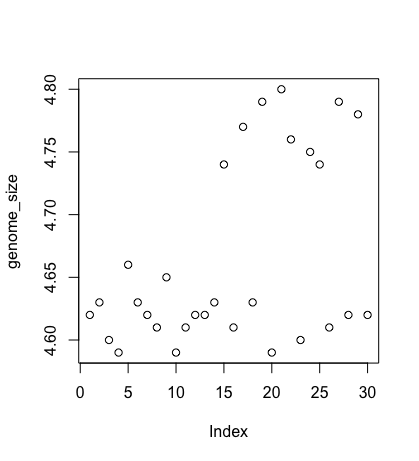

Each point represents a clone and the value on the x-axis is the clone index in the file, where the values on the y-axis correspond to the genome size for the clone. For any plot you can customize many features of your graphs (fonts, colors, axes, titles) through [graphic options](http://www.statmethods.net/advgraphs/parameters.html) For example, we can change the shape of the data point using `pch`.
```
    plot(genome_size, pch=8)
```
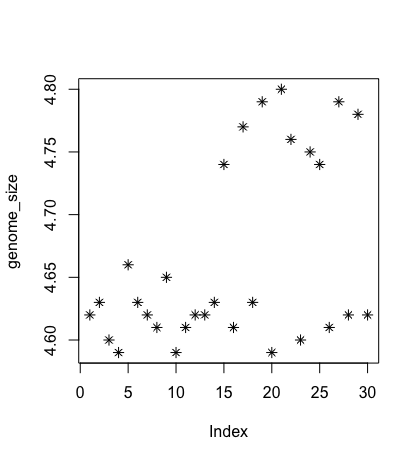

We can add a title to the plot by assigning a string to `main`:
```
    plot(genome_size, pch=8, main="Scatter plot of genome sizes")
```
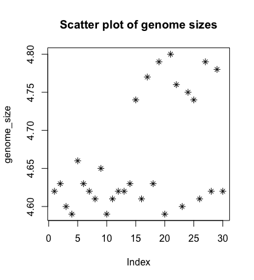

Histogram
---------

Another way to visualize the distribution of genome sizes is to use a histogram, we can do this buy using the `hist` function:
```
    hist(genome_size)
```
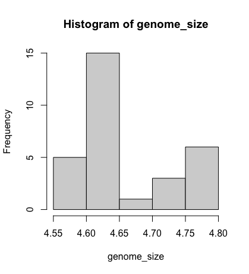

Boxplot
-------

Using additional information from our metadata, we can use plots to compare values between the different citrate mutant status using a **boxplot**. A boxplot provides a graphical view of the median, quartiles, maximum, and minimum of a data set.
```
    # creating a boxplot
    cit <- metadata$cit
    boxplot(genome_size ~ cit, metadata)
```
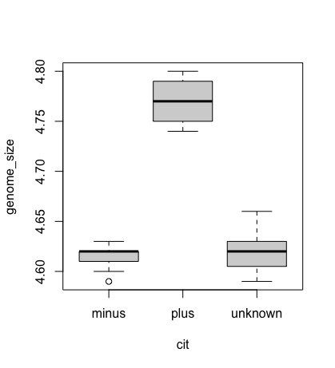

Similar to the scatterplots above, we can pass in arguments to add in extras like plot title, axis labels and colours.
```
    boxplot(genome_size ~ cit, metadata,  col=c("pink","red", "orange"),
            main="Average expression differences between cell types", ylab="Expression")
```
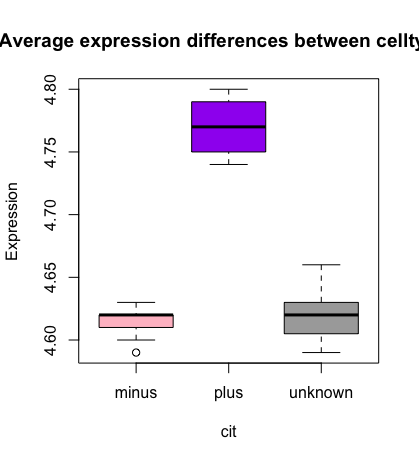

> Hint: For more options for boxplots please explore [here](https://www.datamentor.io/r-programming/box-plot).
> Or use the [R gallery](https://r-graph-gallery.com/) to visualise what plot you would like and some example code to adapt.

Advanced figures (`ggplot2`)
============================

More recently, R users have moved away from base graphic options and towards a plotting package called [`ggplot2`](http://docs.ggplot2.org/) that adds a lot of functionality to the basic plots seen above. The syntax takes some getting used to but it’s extremely powerful and flexible. We can start by re-creating some of the above plots but using ggplot functions to get a feel for the syntax.

`ggplot2` is best used on data in the `data.frame` form, so we will will work with `metadata` for the following figures. Let’s start by loading the `ggplot2` library.
```
    library(ggplot2)
```
The `ggplot()` function is used to initialize the basic graph structure, then we add to it. The basic idea is that you specify different parts of the plot, and add them together using the `+` operator.

We will start with a blank plot and will add layers as we go along.
```
    ggplot(metadata)
```

Geometric objects are the actual marks we put on a plot. Examples include:

*   points (`geom_point`, for scatter plots, dot plots, etc)
*   lines (`geom_line`, for time series, trend lines, etc)
*   boxplot (`geom_boxplot`, for, well, boxplots!)

A plot **must have at least one geom**; there is no upper limit. You can add a geom to a plot using the + operator
```
    ggplot(metadata) +
      geom_point() 
```

Each type of geom usually has a **required set of aesthetics** to be set, and usually accepts only a subset of all aesthetics – refer to the geom help pages to see what mappings each geom accepts. 


Aesthetic mappings are set with the aes() function. Examples include:
*   position (i.e., on the x and y axes)
*   colour (“outside” colour)
*   fill (“inside” colour) shape (of points)
*   line type
*   size

To start, we will add the column names that correspond to the variable we want to set for the x- and y-values.
`geom_point` requires arguments for x and y, all other arguements are optional.
We will run the most basic scatterplot of `sample` against `genome size`.
```
    ggplot(metadata) +
      geom_point(aes(x = sample, y= genome_size))
```
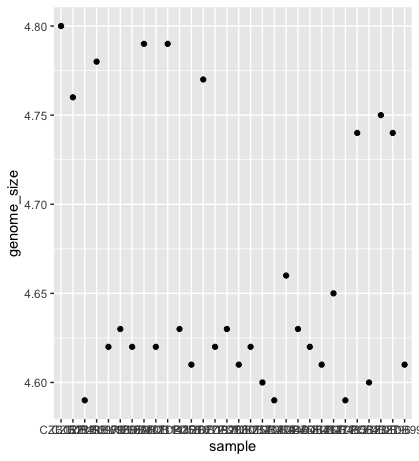

The problem is that the labels on the x-axis are quite hard to read. To change this we need to add an additional theme layer. The ggplot2 `theme` system handles non-data plot infomation such as:

*   Axis labels
*   Plot background
*   Facet label background
*   Legend appearance

There are built-in themes we can use, or we can adjust specific elements. 


For our figure we will change the x-axis labels to be plotted on a 45 degree angle with a small horizontal shift to avoid overlap. 

We will also add some additional aesthetics by assigning them to other variables in our dataframe. 

_For example, the color of the points will reflect the number of generations and the shape will reflect citrate mutant status._ The size of the points can be adjusted within the `geom_point` but does not need to be included in `aes()` since the value is not assigned to a variable.
```
    ggplot(metadata) +
      geom_point(aes(x = sample, y= genome_size, color = generation, shape = cit), size = rel(3.0)) +
      theme(axis.text.x = element_text(angle=45, hjust=1))
```
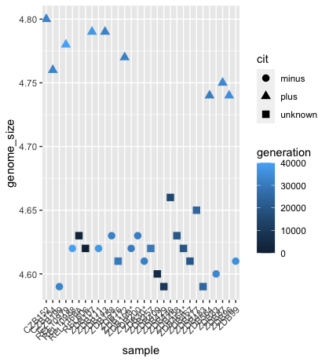

Histogram
---------

To plot a histogram we require another geometric object `geom_bar`, which requires a statistical transformation. Some plot types (such as scatterplots) do not require transformations, each point is plotted at x and y coordinates equal to the original value. Other plots, such as boxplots, histograms, prediction lines etc. need to be transformed, and usually has a default statistic that can be changed via the `stat_bin` argument.
```
    ggplot(metadata) +
      geom_histogram(aes(x = genome_size))
```

Try plotting with the default value and compare it to the plot using the binwidth values. How do they differ?

```
    ggplot(metadata) +
      geom_bar(aes(x = genome_size), stat = "bin", binwidth=0.05)
```


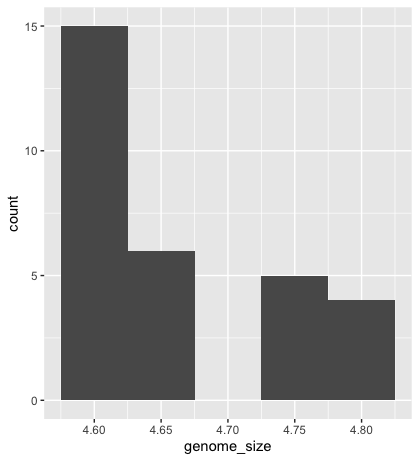


Please explore the different options found on the [cheatsheet](https://www.maths.usyd.edu.au/u/UG/SM/STAT3022/r/current/Misc/data-visualization-2.1.pdf)


> Exercise
> --------
> Go to the [R Gallery](https://r-graph-gallery.com/). Choose your favourite histogram. Change the colour of the histogram to red. Should this be within the `aes()` function, or outside?
> 
>  **Hint** Look at the cheatsheet


Boxplot
-------

Now that we have all the required information, let’s try plotting a boxplot similar to what we had done using the base plot functions at the start of this lesson. 

We can add some additional layers to include a plot title and change the axis labels. 


Explore the code below and all the different layers that we have added to understand what each layer contributes to the final graphic.
```
    ggplot(metadata) +
      geom_boxplot(aes(x = cit, y = genome_size, fill = cit)) +
      ggtitle('Boxplot of genome size by citrate mutant type') +
      xlab('citrate mutant') +
      ylab('genome size') +
      theme(panel.grid.major = element_line(size = .5, color = "grey"),
              axis.text.x = element_text(angle=45, hjust=1),
              axis.title = element_text(size = rel(1.5)),
              axis.text = element_text(size = rel(1.25)))
```
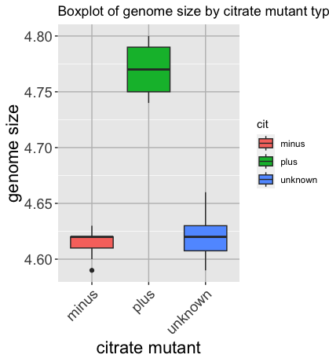

> Exercise
> --------
> Check out other options using the [r-graph gallery](https://r-graph-gallery.com/264-control-ggplot2-boxplot-colors.html).
> 

Writing figures to file
=======================

There are two ways in which figures and plots can be output to a file (rather than simply displaying on screen). The first (and easiest) is to export directly from the RStudio ‘Plots’ panel, by clicking on `Export` when the image is plotted. This will give you the option of `png` or `pdf` and selecting the directory to which you wish to save it to.

The second option is to use R functions in the console, allowing you the flexibility to specify parameters to dictate the size and resolution of the output image. Some of the more popular formats include `pdf()`, `png()`, which are functions that initialize a plot that will be written directly to a file in the `pdf` or `png` format, respectively. Within the function you will need to specify a name for your image in quotes and the width and height. Specifying the width and height is optional, but can be very useful if you are using the figure in a paper or presentation and need it to have a particular resolution. Note that the default units for image dimensions are either pixels (for png) or inches (for pdf). To save a plot to a file you need to:

1.  Initialize the plot using the function that corresponds to the type of file you want to make: `pdf("filename")`
2.  Write the code that makes the plot.
3.  Close the connection to the new file (with your plot) using `dev.off()`.

```
    pdf("figure/boxplot.pdf")
    
    ggplot(example_data) +
      geom_boxplot(aes(x = cit, y =....) +
      ggtitle(...) +
      xlab(...) +
      ylab(...) +
      theme(panel.grid.major = element_line(...),
              axis.text.x = element_text(...),
              axis.title = element_text(...),
              axis.text = element_text(...)
    
    dev.off()

```


> Exercise
> --------
> Make the ugliest plot you can! Hint if you can make it uglier than Katherine's favourite graph I will be impressed
> 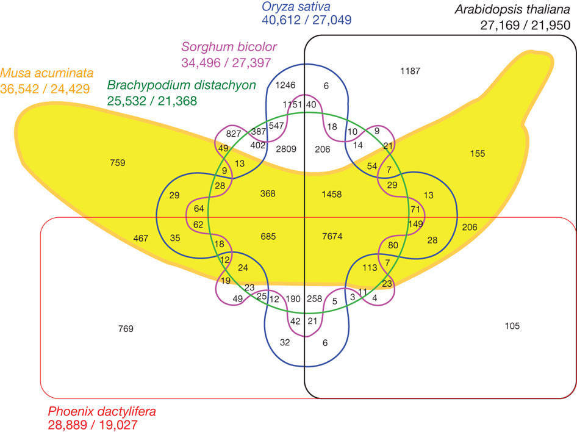


Resources:
----------

We have only scratched the surface here. To learn more, see the [ggplot2 reference site](http://docs.ggplot2.org/), and Winston Chang’s excellent [Cookbook for R](http://wiki.stdout.org/rcookbook/Graphs/) site. Though slightly out of date, [ggplot2: Elegant Graphics for Data Anaysis](http://www.amazon.com/ggplot2-Elegant-Graphics-Data-Analysis/dp/0387981403) is still the definative book on this subject. Much of the material here was adpapted from [Introduction to R graphics with ggplot2 Tutorial at IQSS](http://tutorials.iq.harvard.edu/R/Rgraphics/Rgraphics.html).


If still struggling to use ggplot
---------------------------------
Utilise [ggpubr](https://rpkgs.datanovia.com/ggpubr/) to make it more easier to interact with ggplot. 

  
***

Material adapted from (https://datacarpentry.org/R-genomics/01-intro-to-R.html) and (https://datacarpentry.org/semester-biology/materials/r-intro/)

[Data Carpentry](http://datacarpentry.org/), 2017-2018. [License](LICENSE.html). [Contributing](CONTRIBUTING.html).  
